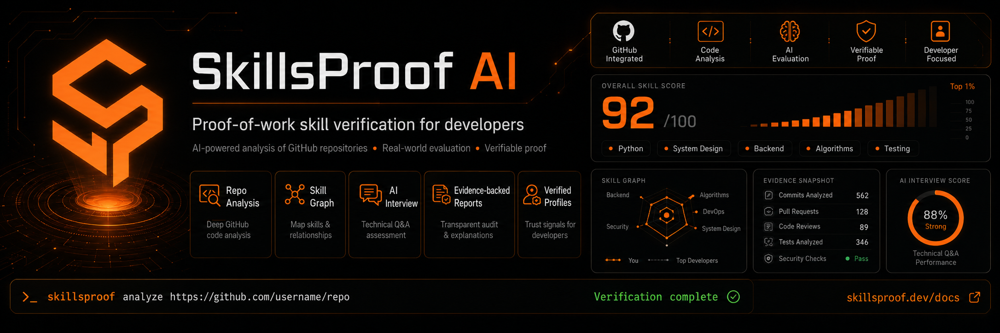

<<<<<<< HEAD
=======


>>>>>>> aa9ed9b (fix: update SkillProof image reference and add new developer image)
# SkillProof AI

SkillProof AI is a proof-of-work developer verification SaaS. It verifies real GitHub projects, local terminal proof, own-code interviews, AI-collaboration challenges, ownership signals, provider-audited analysis, and evidence-backed scoring into candidate profiles that employers and colleges can trust.

The product policy is strict: real providers only, no silent fallback, no fabricated verification artifacts, no fabricated terminal evidence, and no public report from unsupported scores.

## Roles

- Candidate: starts verification runs, completes own-code interviews and AI-collaboration challenges, saves terminal proof, publishes profiles, manages visibility.
- Employer: searches public/shared profiles, compares candidates, builds interview kits, ranks role fit, downloads public-safe reports.
- College: manages tenant-scoped students, cohorts, readiness, skill gaps, reports, and expiring employer-share links.
- Admin: manages users, tenants, runs, evidence, providers, agents, prompts, rubrics, security policy, audit logs, billing rows, and platform settings.

## Setup

```bash
npm install
cp .env.example .env
npm run db:generate
npm run db:push
npm run db:seed-users
npm run db:seed-registry -- --force
npm run db:seed-prompts
npm run dev
```

Default local seeded users:

- `candidate@skillproof.dev`
- `employer@skillproof.dev`
- `college@skillproof.dev`
- `admin@skillproof.dev`

Local seeded account password: `demo1234`.

`npm run setup:demo` runs the full local bootstrap (`db:generate`, `db:push`, seeded users, provider registry, and prompts). `npm run db:seed-users` also creates a clearly labeled private judge walkthrough dataset:

- completed run: `casey-candidate/skillproof-commerce`
- private draft profile: `/profile/casey-candidate-skillproof-ai-demo`
- demo launcher: `/demo`
- certified setup checklist: `/demo/checklist`
- demo cohort: `SkillProof AI Judge Demo Cohort`
- employer shortlist: `Hackathon judge shortlist`

The seeded run is marked `DEMO DATA` in run/profile surfaces. It exists so judges can inspect a completed private flow immediately; it is not presented as a live verification and cannot satisfy public/unlisted publish gates.

## Judge Demo Mode

Open `/demo` after seeding. It provides:

- one-line product explanation
- problem/solution framing
- Candidate, Employer, College, and Admin demo buttons
- completed private run/profile/report links
- certified setup checklist
- live repository verification path
- seeded account emails and the shared local password

Recommended judging order:

1. `/demo`
2. Candidate seeded account -> completed run -> private draft profile
3. Candidate seeded account -> `/candidate/new-verification` for a live repo run
4. Employer seeded account -> search, compare, shortlist, interview kit
5. College seeded account -> dashboard, cohort, skill gaps, placement readiness, employer share
6. Admin seeded account -> provider health, runs, evidence, agents, prompts, audit logs

## Environment

Required:

- `DATABASE_URL`
- `NEXTAUTH_SECRET`
- `NEXTAUTH_URL`

Provider-specific:

- `ANTHROPIC_API_KEY` for Anthropic API mode.
- `GITHUB_TOKEN` is optional and only raises GitHub API rate limits.

Runtime controls:

- `SKILLPROOF_WORKER_MODE=1` makes API requests enqueue pending runs for `npm run worker`.
- `SKILLPROOF_TERMINAL_ENABLED=1` enables local terminal proof. Leave disabled in production unless container isolation is deployed.
- `SKILLPROOF_PUBLIC_REPORTS_ENABLED=0` disables public profile report downloads.
- `SKILLPROOF_OWNERSHIP_SECRET` optionally overrides the HMAC secret for server-issued ownership challenge tokens. If omitted, `NEXTAUTH_SECRET` is used.

Model overrides:

- `MODEL_ORCHESTRATOR=claude-opus-4-7`
- `MODEL_WORKER=claude-sonnet-4-6`
- `MODEL_VALIDATOR=claude-opus-4-7`

## Provider Policy

Supported runtime providers:

- `anthropic_api`
- `claude_cli`
- `codex_cli`
- `copilot_cli`
- `ollama`
- `deterministic`

`deterministic` is only for evidence-derived stages such as repo scanning, git evidence, and skill graph aggregation. It cannot generate LLM output.

Provider failures fail closed:

- unavailable provider: mission start is blocked for required agents
- invalid JSON: one repair attempt where supported, then structured failure
- timeout: structured timeout failure
- optional skipped agent: excluded from score denominator

Fallback strategies are limited to `fail`, `retry`, and `skip_optional`. There is no synthetic provider fallback.

## Provider Health

Open `/admin/providers/health` after seeding the registry.

Every provider health row shows enabled state, installation/auth state, version, configured model, available models where known, JSON contract result, non-interactive support, model/reasoning support, last test time, latency, raw output preview, last error, fix instructions, and a Run test action.

Mission start checks required providers before creating a run. A blocked start returns `provider_not_ready` with exact blockers and setup instructions.

## CLI Setup

Codex CLI:

```bash
npm install -g @openai/codex
codex
codex --version
```

Sign in with ChatGPT or configure supported API-key auth, then run the admin provider health test.

Claude CLI:

```bash
# install Claude Code from Anthropic's official instructions
claude auth login
claude --version
```

Then run the admin provider health test.

GitHub Copilot CLI:

- Install/configure the modern `copilot` binary.
- Do not rely on the retired `gh copilot` extension for scoring.
- Sign in, then run the admin provider health test.

Ollama:

```bash
ollama serve
ollama pull llama3.2
```

Set the desired model in Admin -> Providers and run the health test. SkillProof never auto-pulls models.

Anthropic API:

```bash
ANTHROPIC_API_KEY=...
```

Run the admin provider health test. Use Opus-class models for orchestrator/validator agents and Sonnet-class models for worker/profile agents when cost matters.

## Terminal Safety

The sandbox terminal is authenticated and run-scoped.

Controls:

- owner/admin mutation access required
- jailed to `.skillproof/runs/<run_id>`
- command allowlist
- destructive command and env-dump blocklist
- `node -e`, `python -c`, `curl | bash`, `iwr | iex`, SSH/private-key access blocked
- timeout, truncation, secret redaction, output hash
- audit logs for denied, approval-required, approved, executed, and saved evidence actions
- production disabled unless `SKILLPROOF_TERMINAL_ENABLED=1`
- install commands require a second explicit approval

Saving terminal evidence marks an existing command run as evidence. It does not rerun the command.

## AI-Collaboration Challenge Proof

The AI challenge is now executable proof, not only a text questionnaire. When a candidate submits a valid unified diff, SkillProof creates a challenge workspace at `.skillproof/runs/<run_id>/ai-challenge`, safely clones the candidate repo, runs `git apply --check`, applies the patch if valid, and then runs available safe npm checks (`test`, `typecheck`, `lint`, `build`). Command output is redacted, summarized, hashed, and persisted as `TerminalCommandRun` rows plus `EvidenceFinding` rows.

Score caps are enforced:

- patch cannot apply or is not a unified diff: max 45
- no executable checks available: max 70
- tests/build/typecheck/lint fail: max 65
- candidate did not review AI output: review discipline max 50
- candidate did not discuss limitations/tradeoffs: AI collaboration maturity max 70

The evaluator uses both deterministic execution proof and candidate explanation/review behavior. Public and employer-safe views show summaries only, never raw diffs, raw prompts, raw terminal logs, or private traces.

## Ownership Verification

The candidate wizard calls `/api/ownership/challenge` to issue a signed token before analysis. The token is tied to:

- signed-in user ID
- GitHub repo owner/name
- ownership challenge ID
- expiration

Only the token hash is stored. Candidates can place the token in `.skillproof-verify.json` or README. The local proof runner and `/api/ownership/verify` scan for server-issued tokens and compare hashes. If no owner, collaborator, or token proof is found, ownership remains `self_declared` and public trust badges stay capped.

## Public Profiles And Reports

Public profiles and employer reports use public/shared profile data only. They do not expose raw context packs, raw prompts, raw model outputs, admin traces, private terminal output, private interview answers, secrets, or unpublished/private data.

Private reports require owner/admin access. College reports are tenant-scoped. Employer reports are public-safe.

Seeded demo artifacts, mock sources, heuristic sources, missing evidence, raw trace markers, and secret-like payloads block public/unlisted publishing. If no real provider has passed health checks, SkillProof AI permits private walkthroughs only.

Changing an existing profile from private to public/unlisted re-runs the same publish gates as first publish. Unsafe or missing evidence cannot be made public by editing visibility.

## Scoring

Rubric:

- Code Quality: 15
- Architecture: 15
- Testing: 15
- Debugging: 15
- Git Workflow: 10
- Documentation: 10
- Security: 10
- Communication: 5
- AI Collaboration: 5

Every score needs evidence, source, and confidence. Not measured skills are excluded from the denominator. Validator agents can lower, cap, or flag unsupported claims but cannot raise scores.

Allowed score sources:

- `llm`
- `terminal`
- `github_api`
- `local_clone`
- `interview`
- `challenge`
- `deterministic`
- `not_measured`

## Verification Commands

```bash
npm run typecheck
npm run test
npm run build
```

Required certification sequence:

```bash
npm install
npm run db:generate
npm run db:push
npm run db:seed-users
npm run db:seed-registry -- --force
npm run db:seed-prompts
npm run typecheck
npm run test
npm run build
npm run dev
```

Route checklist for judges:

- `/demo`
- `/demo/checklist`
- `/login`
- `/candidate/dashboard`
- `/candidate/new-verification`
- `/candidate/runs/[id]`
- `/candidate/interview/[runId]`
- `/candidate/ai-challenge/[runId]`
- `/profile/casey-candidate-skillproof-ai-demo`
- `/employer/search`
- `/employer/compare`
- `/employer/shortlist`
- `/college/dashboard`
- `/college/cohorts`
- `/college/skill-gaps`
- `/admin/dashboard`
- `/admin/providers/health`
- `/admin/runs`
- `/admin/evidence`

Additional docs:

- `docs/DEMO_SCRIPT.md`
- `docs/JUDGE_WALKTHROUGH.md`
- `docs/ARCHITECTURE.md`
- `docs/TRUST_MODEL.md`
- `docs/PROVIDER_SETUP.md`
- `docs/SECURITY.md`
- `docs/SECURITY_MODEL.md`
- `docs/HACKATHON_DEMO_SCRIPT.md`
- `DEMO_LIMITATIONS.md`

Recommended hackathon demo process:

```bash
SKILLPROOF_WORKER_MODE=1 npm run dev
SKILLPROOF_WORKER_MODE=1 npm run worker
```

PowerShell:

```powershell
# terminal 1
$env:SKILLPROOF_WORKER_MODE="1"; npm run dev

# terminal 2
$env:SKILLPROOF_WORKER_MODE="1"; npm run worker
```

PowerShell setup/check sequence:

```powershell
npm install
Copy-Item .env.example .env
npm run db:generate
npm run db:push
npm run db:seed-users
npm run db:seed-registry -- --force
npm run db:seed-prompts
npm run typecheck
npm run test
npm run build
```

Worker demo mode, Bash:

```bash
SKILLPROOF_WORKER_MODE=1 npm run dev
SKILLPROOF_WORKER_MODE=1 npm run worker
```

Worker demo mode, PowerShell:

```powershell
$env:SKILLPROOF_WORKER_MODE="1"; npm run dev
$env:SKILLPROOF_WORKER_MODE="1"; npm run worker
```

Run the dev server and worker in separate terminals.

Plain local fallback:

```bash
npm run dev
```

If `SKILLPROOF_WORKER_MODE` is not set in local development, runs use the visible in-process fallback banner on the run detail page.

## Real-Provider Demo Script

1. Sign in as `admin@skillproof.dev`.
2. Configure at least one real provider in `/admin/providers`.
3. Run `/admin/providers/health` tests until required providers show passing JSON contract results.
4. Sign in as `candidate@skillproof.dev`.
5. Start a run from `/candidate/new-verification` against a real GitHub repository.
6. Open the run page, inspect provider readiness, agent progress, evidence, ownership, terminal proof, scores, and not-measured dimensions.
7. Complete `/candidate/interview/[runId]`.
8. Complete `/candidate/ai-challenge/[runId]`.
9. Save allowlisted terminal proof from `/candidate/runs/[id]/terminal`.
10. Publish the candidate profile.
11. Sign in as employer, use search, compare, role fit, candidate detail, report download, and interview kit.
12. Sign in as college, inspect dashboard, students, cohorts, skill gaps, placement readiness, reports, and employer share.
13. Sign in as admin, inspect run trace, providers, agents, evidence, audit logs, security, rubrics, and settings.

## Troubleshooting

- `provider_not_ready`: run Admin -> Providers -> Health and fix every blocker.
- `provider_invalid_json`: lower temperature, update prompt, switch model, or use a provider that passes JSON contract tests.
- `provider_not_authenticated`: sign in or set the required API key.
- `missing_binary`: install the CLI and verify `--version`.
- `unsupported_for_scoring`: provider cannot run non-interactively or cannot satisfy JSON scoring.
- `terminal_disabled`: set `SKILLPROOF_TERMINAL_ENABLED=1` only when production terminal execution is intended.
- `forbidden`: verify role, run ownership, tenant membership, and profile visibility.
- build failures: run `npm run typecheck`, `npm run test`, then `npm run build` locally and inspect the first failing file.
